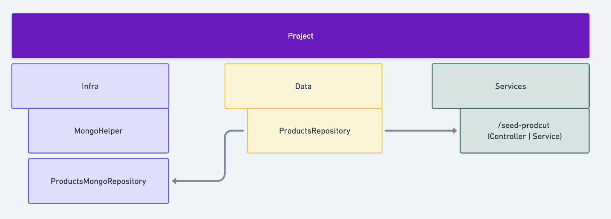

# Database

## Implementation

For the current issue, MongoDB was added inside Docker Compose. This way, when the command `pnpm docker-up` is used, it will set up the project and the database.

## Structure for Database Usage

After implementing MongoDB, I also included an example of how I would structure the API to use the database connection.

One point I focused on is to NEVER implement external dependencies directly into our application (following the Dependency Inversion principle).

Thus, we have a few DOMAINS:

- **Infra** - **Database** & **Docker**
  - This is where the MongoHelper, Schemas, MongoRepositories, and Docker files are located.
- **Data** - Internal repositories & protocols
  - This layer contains repositories where we will inject MongoRepositories. This way, if we ever need to switch from MongoDB to another database, we only need to change it here, without affecting the source code and logic.
- **Domain** - Place where we define data models and service use cases

## Test Implementation

I created a route located at `POST - /api/seed-products`. This route will use a large mock dataset of products, feel free to test it.

I suggest using this [Mongo extension](https://marketplace.visualstudio.com/items?itemName=mongodb.mongodb-vscode) to check the seeded data.

A database connection test was also created. To run it, simply execute the command `pnpm test` inside the Docker container.

